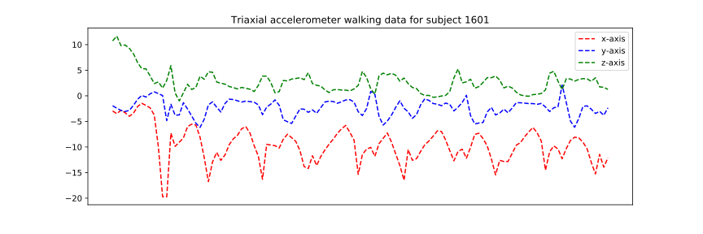
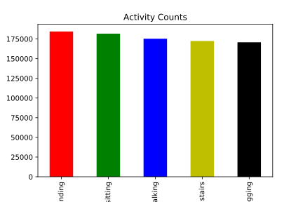
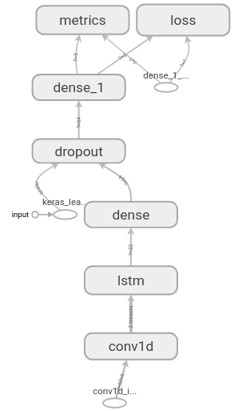
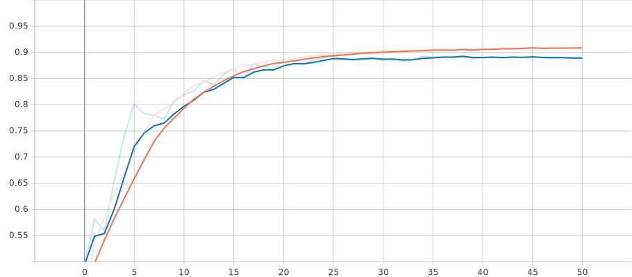
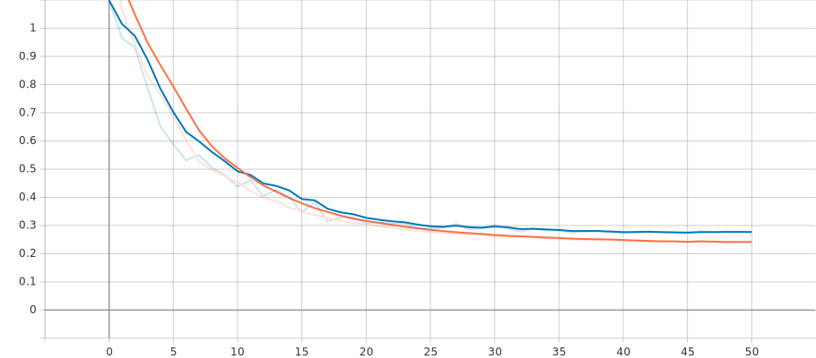

# Human Activity Recognition From Inertial Sensors
### Machine Learning Engineer Nanodegree Project Report
Md. Rayed Bin Wahed

January 22nd, 2020

# I. Definition
### Project Overview
The problem of automatic identification of physical activities performed by human subjects is referred to as Human Activity Recognition (HAR) [1]. HAR is an attractive area of research due to its application in areas such as smart environments and healthcare [2], especially in the Intellectual and Developmental Disability (I/DD) space where I operate. If embedded inertial measuring units (IMU) such as accelerometers and gyroscopes found in smartphones and smartwatches can be used to  predict Activities of Daily Living (ADL), then patients with I/DD can be accurately monitored and a much better care given. As of today no such system exists. It is my goal to introduce such a mechanism.

### Problem Statement
The goal is to use raw accelerometer and gyroscope smartwatch data to classify 5 Activities of Daily Living. The activities are:
1. Walking
2. Jogging
3. Sitting
4. Standing
5. Climbing stairs

### Metrics
The metric for this task is accuracy. Since, it is a multi-class classification task with a balanced dataset, a simple accuracy score will suffice to measure the model's performance. Accuracy is defined as follows:

**Accuracy = (TP + TN) / (TP + FP + FN + TN)**

# II. Analysis
### Data Exploration
The dataset is the [3] [WISDM Smartphone and Smartwatch Activity and Biometrics Dataset Data Set](https://archive.ics.uci.edu/ml/datasets/WISDM+Smartphone+and+Smartwatch+Activity+and+Biometrics+Dataset+) which contains accelerometer and gyroscope time-series sensor data collected from a smartwatch as 51 test subjects perform 18 activities for 3 minutes each. Particulars of the dataset are summarized below:

| Dataset Feature  | Value |
| ------------- | ------------- |
| Number of subjects  | 51  |
| Number of activities  | 5  |
| Minutes collected per activity  | 3  |
| Sensor polling rate  | 20 Hz |
| Smartwatch used  | LG G Watch  |
| Number of raw measurements  | 2,003,074  |

| Field Name  | Description |
| ------------- | ------------- |
| Subject-id  | Type: Symbolic numeric identififier. Uniquely identifyies the subject. Range: 1600-1650.  |
| Activity code  | Type: Symbolic single letter. Identifies a specific activity. Range: A-S (no “N” value)  |
| Timestamp  | Type: Integer. Linux time  |
| x  | Type: Real. Sensor value for x axis. May be positive or negative. m/s2 for acceleration and radians/s for gyroscope |
| y  | Same as x but for y axis  |
| z  | Same as x but for z axis  |

The data for the two sensors are recorded in different directories. Within each subdirectory there is a file per subject of the activities he/she performed. So there are 51 files in total in each directory. The data is read into memory and merged by timestamp. This results in a final dataset of size `(856037, 9)` because both sensor readings did not exist for all timestamps. Additionally, this process also makes the readings for some subjects inconsistent because of numerous missing values. Those data points are subsequently dropped. This is a problem with this dataset. While it claims to have supplied ample time-stamped data, the actual number of examples with the exact same timestamp is in reality quite low.

### Exploratory Visualization

### Algorithm and Techniques
I chose to frame this as a sequence classification problem. Therefore, The algorithm is a 1D convolution followed by a LSTM layer. I chose an LSTM because it is good at remembering patterns in sequences. This problem has traditionally been solved with Support Vector Machines and even CNNs. However, for my case, learning the underlying the pattern in the data is more important than simply learning the data because I intend to use this model to fine-tune actual data from the developmentally disabled. 

To achieve this, I used the 1D convolution and LSTM layers from the TensorFlow library to train this model. Here is the model architecture.

### Benchmark
Numerous groups obtained numerous accuracies in the past using smartphone data. Accuracy ranged from 90% to 99% depending on the set of sensor values used and the generation of synthetic data (average, mean, standard deviation, etc). I was unable to find a study that solely relied on smartwatch data to detect human activities of daily living. Therefore, an accuracy of 90% would be acceptable given the current literature.

# III. Methodology
### Data Preprocessing
The data was preprocessed in the following ways:
1. Merge acceleration and gyroscope data to obtain 6 features (triaxes of accelerometer and gyroscope).
2. The values were normalized using min-max scaler.
3. The activity code values were label encoded to integers.
4. A sliding window of 60 examples were taken (corresponding to 3 secs of measurement since the rate of sampling was 20 Hz) and reshaped to form sequences of shape `(60, 6)`. This resulted in a final dataset shape of `(14209, 60, 6)`.
5. The dataset was split into 80% training data and 20% test data.
6. The training dataset was further split into 10% validation data.

### Implementation
During my inspection phase, I had to decide how best to combine the data. If I combined based on timestamp, the number of data points were severly reduced. On the otherhand, what do I do for an activity for which the accelerometer and gyroscope readings varied significantly in number. In order to decide, I had to create both dataset and see which performed better. The former provided better accuracy despite producing a lower dataset size. Writing the preprocessing code itself provided numerous challenges and required significant effort to verify the integrity of the data.

Deciding the sequence length was also challenging. Arthur et al [2], found 10 second intervals to be ideal. For me 3 seconds worked well since I want to provide real-time predictions.

### Refinement
The network architecture gave very different results with each set of hyperparameters. The number of filters in the 1D convolution layer and hidden units in the LSTM layer had to be significantly tuned in order to get a good score. I also stacked 2 LSTMs but couldn't recognize a decent improvement. Lastly, the dropout rate and units in the densely connected layer were selected by monitoring activation maps in tensorboard.

Learning rate scheduler was used to train the model to gradually decrease the learning rate as the trained progressed. This prevented abnormal spikes in the training process and made the model more robust. 

Early stopping of validation loss with a patience of 5 epochs prevented overfitting the data.

# IV. Results
### Model Evaluation and Validation

### Justification
An accuracy of 90% on the test set is what I was hoping for. The model does not suffer from high bias or high variance given how the accuracy and loss curve closely follow each other. 

# V. Conclusion

## References
1. Antonio Bevilacqua, Kyle MacDonald, Aamina Rangarej, Venessa Widjaya, Brian Caulfield, Tahar Kechadi, “Human Activity Recognition with Convolutional Neural Networks”, arXiv:1906.01935v1 [cs], June 2019.
2. Artur Jordao, Antonio C. Nazare Jr., Jessica Sena, William Robson Schwartz, “Human Activity Recognition Based on Wearable Sensor Data: A Standardization of the State-of-the-Art”, arXiv:1806.05226v3 [cs], February 2019.
3. Smartphone and Smartwatch-Based Biometrics Using Activities of Daily Living. IEEE Access, 7:133190-133202, Sept. 2019.
