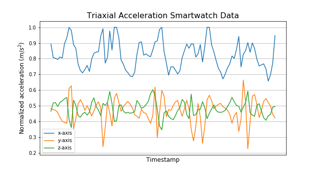

# Human Activity Recognition From Inertial Sensors
## Machine Learning Engineer Nanodegree Project Report
Md. Rayed Bin Wahed

January 22nd, 2020

# I. Definition
## Project Overview
The problem of automatic identification of physical activities performed by human subjects is referred to as Human Activity Recognition (HAR) [1]. HAR is an attractive area of research due to its application in areas such as smart environments and healthcare [2]. It is even more so relevant in the Intellectual and Developmental Disability (I/DD) space. If embedded Inertial Measurement Units (IMU) such as accelerometers and gyroscopes found in smartphones and smartwatches can be used to predict Activities of Daily Living (ADL), then motion-based behavioral biometrics of patients with I/DD can be accurately recorded and monitored even when they are not being supervised by their Direct Support Staff (DSP). This has the potential to aid agencies that support I/DD patients provide much better health care and possibly detect harmful physiological incidents before they occur. Additionally, smartwatches and smartphones have the added advantage of being unobtrusive which adds to their appeal and acceptability with I/DD patients. As of today, no such system exists. It is my intention to introduce such a mechanism.

## Problem Statement
In this project I wish to investigate the feasibility of using smartwatch sensor data to accurately identify human activities. My goal is to use raw accelerometer and gyroscope readings and classify 5 Activities of Daily Living. The activities are:

1. Walking
2. Jogging
3. Sitting
4. Standing
5. Climbing stairs

I wish to preprocess the data into sequences of length 60 (corresponding to 3 seconds of data) using the triaxial accelerometer and gyroscope readings as features (6 in total) and train a LSTM network. I am chosing an LSTM network because I believe it will be able to learn the patterns inherent in these activities and hence, be a more robust classifier as opposed to statistical models such as Decision Trees and SVMs. Furthermore, I hope to use this model for other downstream tasks such as human identification in the future [4]. 

## Metrics
The metric for this task is accuracy. Since, it is a multi-class classification task with a balanced dataset, a simple accuracy score will suffice to measure the model's performance. Accuracy is defined as follows:

  <strong>Accuracy = (TP + TN) / (TP + FP + FN + TN)</strong>

# II. Analysis
## Data Exploration
The dataset is the [WISDM Smartphone and Smartwatch Activity and Biometrics Dataset](https://archive.ics.uci.edu/ml/datasets/WISDM+Smartphone+and+Smartwatch+Activity+and+Biometrics+Dataset+) [3] which contains accelerometer and gyroscope time-series sensor data collected from a smartphone and smartwatch as 51 test subjects perform 18 activities for 3 minutes each. For this project I will only be considering smartwatch data. Particulars of the dataset are summarized below:

Table 1. Dataset summary.

| Feature  | Value |
| ------------- | ------------- |
| Number of subjects  | 51  |
| Number of activities  | 5  |
| Minutes collected per activity  | 3  |
| Sensor polling rate  | 20 Hz |
| Smartwatch used  | LG G Watch  |
| Number of raw measurements  | 2,003,074  |

Table 2. Field description.

| Field | Description |
| ------------- | ------------- |
| Subject id  | Type: Symbolic numeric identififier. Uniquely identifyies the subject. Range: 1600-1650.  |
| Activity code  | Type: Symbolic single letter. Identifies a specific activity. Range: A-S (no “N” value)  |
| Timestamp  | Type: Integer. Linux time  |
| x  | Type: Real. Sensor value for x-axis measured in m/s2 for acceleration and radians/s for gyroscope. May be positive or negative.|
| y  | Same as x but for y-axis  |
| z  | Same as x but for z-axis  |

Furthermore, the data is evenly distributed with no missing or duplicate values. The values all appear realistic with little to no outliers. This is because the measurements were taken in a controlled environment. That said, the range of acceleration values is much greater and the number of readings captured per interval is consistent. H

 
   

## Exploratory Visualization
Figure 1. Graphical plot of the smartwatch triaxial accelerometer data for the walking.

  

Figure 2. Sample distribution across each activity.

  

The data represents a subject's walking triaxial accelerometer data for a period of 5 seconds picked randomly. It looks as expected with clear continuous trends. There does not seem to be any disruptive outliers. The gyroscope data not show here is even more symmetric. The authors reported having some problems with their accelerometer readings for some subjects. The accelerometer logged more readings than the gyroscope and they were unable to substantiate why that was the case. For my purpose, I will take the data with a grain of salt and check to see for inaccuracies.   

Additionally, the prediction classes are distributed evenly and well represented in number.

### Algorithm and Techniques
I chose to frame this task as a sequence classification problem. Therefore, The algorithm is a 1D convolution followed by a LSTM layer. I chose an LSTM because it is good at remembering patterns in sequences. This problem has traditionally been solved with Support Vector Machines and even CNNs. However, for my case, learning the underlying the pattern in the data is more important than simply learning the data itself because I intend to use this model to fine-tune actual data from the developmentally disabled. 

At the very core, LSTMs solve the long-term dependecy problem evident in simple RNNs and other types of neural networks. This hinges on the idea that in order to make a prediction for the present step, we may need to rely on data that the network saw in previous timestamps. Propagating useful information throughout the work such that it can be used to make wiser predictions in the future is what sets the LSTM apart and particulary usefule for time-series data. 

So how does it do it. The key to LSTMs is the cell state, the horizontal line running through the top of the diagram. The cell state is kind of like a conveyor belt. It runs straight down the entire chain, with only some minor linear interactions. It’s very easy for information to just flow along it unchanged. The LSTM has the ability to remove or add information to the cell state by carefully regulated by structures called gates [5].

Gates are a way to optionally let information through. They are composed out of a sigmoid neural net layer and a pointwise multiplication operation. The sigmoid layer outputs numbers between zero and one, describing how much of each component should be let through. A value of zero means “let nothing through,” while a value of one means “let everything through!” [5].

An LSTM has three of these gates to protect and control the cell state as shown below.

Figure 3. LSTM cell [5].

  

Convolutions on the other hand are a set of linear transformation filters that extracts local 1D patches to identify patterns within the window of convolution. And because the same transformation is applied on every patch identified by the window, a pattern learnt at one position can also be recognized at a different position, making 1D conv nets translation invariant [7].

Figure 4. Applying 1D Convolution to a sequence of text [6].

  

Figure 5. Custom model architecture.

  

### Benchmark
Different groups obtained numerous accuracies in the past using smartphone data. Accuracy ranged from 90% to 99% depending on the set of sensor values used and the generation of synthetic data (average, mean, standard deviation, etc). I was unable to find a study that solely relied on smartwatch data to detect human activities of daily living. Therefore, an accuracy of 90% would be acceptable given the current literature.

# III. Methodology
### Data Preprocessing
The data was preprocessed in the following ways:
1. Merge acceleration and gyroscope data to obtain 6 features (triaxes of accelerometer and gyroscope).
2. The sensor readings were clipped in the range `(-30, 30)`.
3. The values were normalized using min-max scaler.
4. The activity code values were label encoded to integers.
4. A sliding window of 60 examples were taken (corresponding to 3 secs of measurement since the rate of sampling was 20 Hz) and reshaped to form sequences of shape `(60, 6)`. This resulted in a final dataset shape of `(14209, 60, 6)`.
6. The dataset was split into 80% training data and 20% test data.
7. The training dataset was further split into 20% validation data.

### Implementation
During my inspection phase, I had to decide how best to combine the data. If I combined based on timestamp, the number of data points were severly reduced. On the otherhand, what do I do for an activity for which the accelerometer and gyroscope readings varied significantly in number. In order to decide, I had to create both dataset and see which performed better. The former provided better accuracy despite producing a lower dataset size. Writing the preprocessing code itself provided numerous challenges and required significant effort to verify the integrity of the data.

Deciding the sequence length was also challenging. Arthur et al [2], found 10 second intervals to be ideal. For me 3 seconds worked well since I want to provide real-time predictions.

### Refinement
The network architecture gave very different results with each set of hyperparameters. The number of filters in the 1D convolution layer and hidden units in the LSTM layer had to be significantly tuned in order to get a good score. I also stacked 2 LSTMs but couldn't recognize a decent improvement. Lastly, the dropout rate and units in the densely connected layer were selected by monitoring activation maps in tensorboard.

Learning rate scheduler was used to train the model to gradually decrease the learning rate as the trained progressed. This prevented abnormal spikes in the training process and made the model more robust. 

Early stopping of validation loss with a patience of 5 epochs prevented overfitting the data.

# IV. Results
### Model Evaluation and Validation
Figure 6. Training (orange) and testing (blue) Epoch vs Accuracy graph

Figure 7. Training (orange) and testing (blue) Epoch vs Loss graph

### Justification
An accuracy of 90% on the test set is what I was hoping for. The model does not suffer from high bias or high variance given how the accuracy and loss curve closely follow each other. 

# V. Conclusion
### Free-Form Visualization

The diagram above highlights the inconsistency present in such a large dataset that had to be found and processed.

### Reflection
The project covered the entire ML pipeline from data collection, preprocessing, visualization, to model training and evaluation. I realized that data wrangling is the most important and time consuming aspect in the entire process and was the bottle-neck for me. 

### Improvement
Firstly, some synthetic data might have helped in this case. For instance, the mean, standard deviation, and other statistics could have been calculated for each timestamp and added as features. This might have helped the network segregate the classes and better and lead to a better accuracy. 

A few more model variants could have been trained and evaluated. A comparision of different architectures such as DNN, CNN, and statistical models like SVMs could have also been analyzed.

## References
1. Antonio Bevilacqua, Kyle MacDonald, Aamina Rangarej, Venessa Widjaya, Brian Caulfield, Tahar Kechadi, “Human Activity Recognition with Convolutional Neural Networks”, arXiv:1906.01935v1 [cs], June 2019.
2. Artur Jordao, Antonio C. Nazare Jr., Jessica Sena, William Robson Schwartz, “Human Activity Recognition Based on Wearable Sensor Data: A Standardization of the State-of-the-Art”, arXiv:1806.05226v3 [cs], February 2019.
3. Smartphone and Smartwatch-Based Biometrics Using Activities of Daily Living. IEEE Access, 7:133190-133202, Sept. 2019.
4. G. M. Weiss, K. Yoneda and T. Hayajneh, "Smartphone and Smartwatch-Based Biometrics Using Activities of Daily Living," in IEEE Access, vol. 7, pp. 133190-133202, 2019.
doi: 10.1109/ACCESS.2019.2940729
5. Christopher Olah 2015, Understanding LSTM Networks, accessed 29 January 2020, <https://colah.github.io/posts/2015-08-Understanding-LSTMs/>
6. Jason Brownlee 2018, How to Develop a Multichannel CNN Model for Text Classification, accessed 29 January 2020, <https://machinelearningmastery.com/develop-n-gram-multichannel-convolutional-neural-network-sentiment-analysis/>
7. Debasish Ghosh 2018, When is a 1D Convolutional Neural Network appropriate to use?, accessed 30 January 2020, <https://www.quora.com/When-is-a-1D-Convolutional-Neural-Network-appropriate-to-use>
